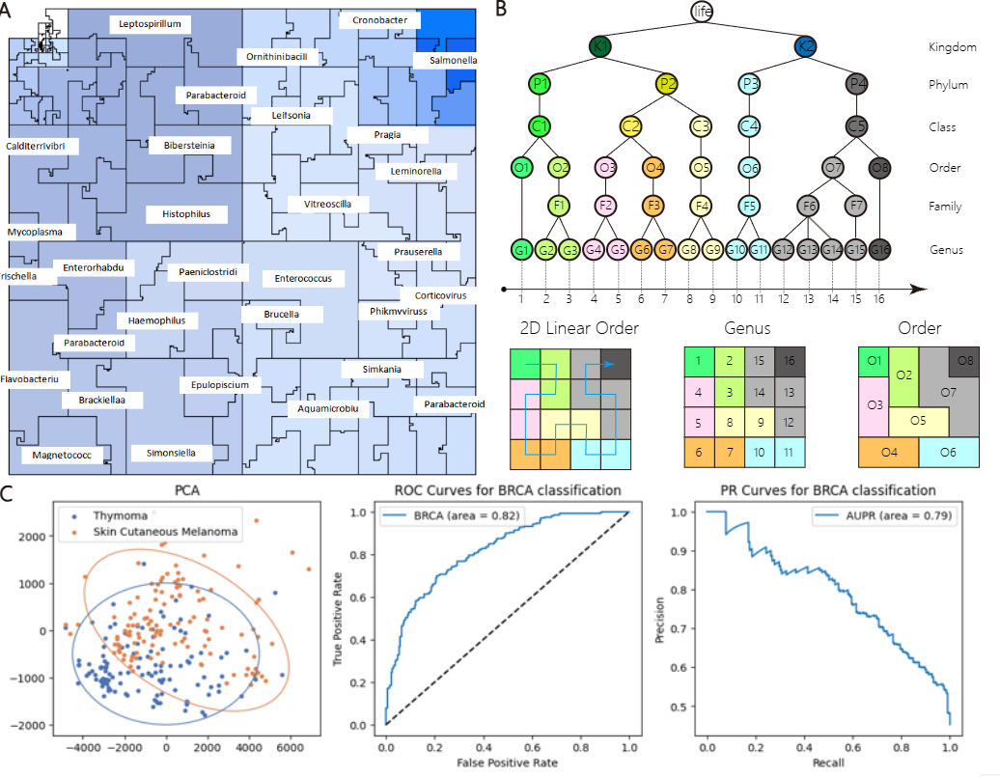
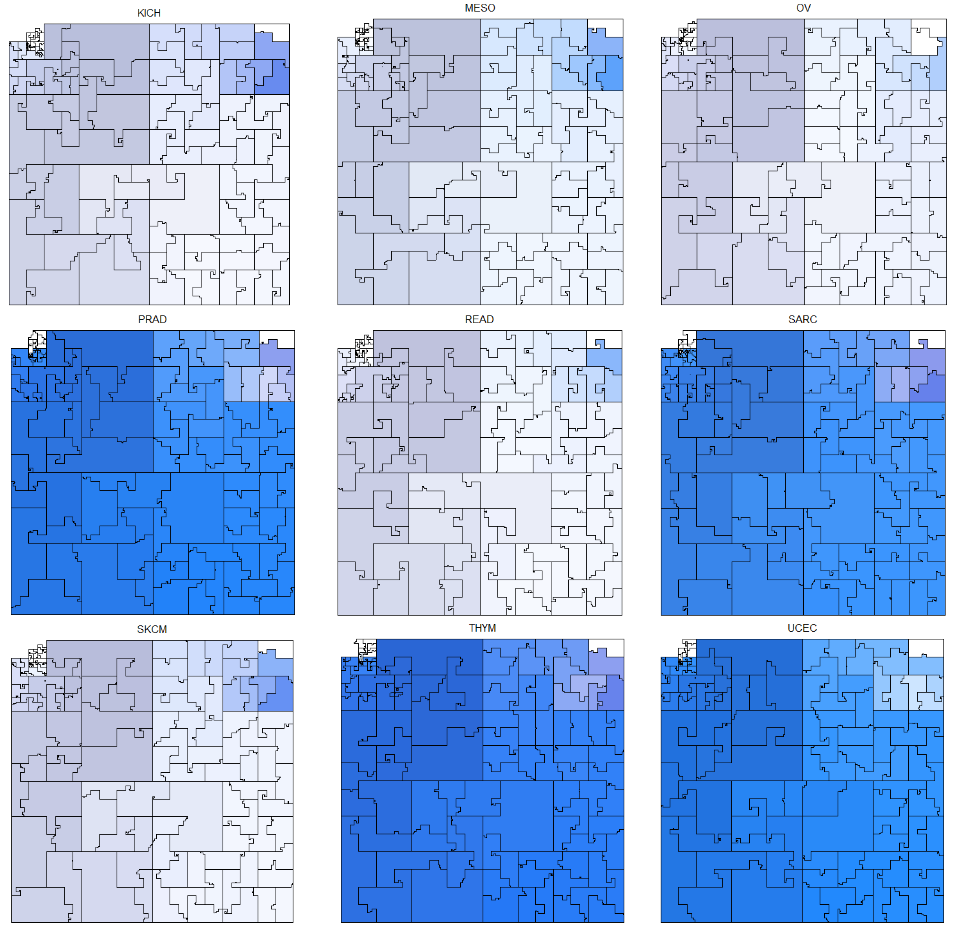

# Hilbert Cruve
This repository contains an algorithm for visualizing microbiomes using the Hilbert curve. The algorithm maps microbiome relative abundance information onto a two-dimensional space through the Hilbert curve, enabling visualization of microbiome variations.
## Introduction
Microbiome samples are now routinely created using low-cost, high-throughput metagenomics DNA sequencing. The next step is creating microbial community abundance profiles by mapping sequenced reads against reference genome collections like Ensembl or RefSeq. Tools like Flint and Kraken 2 facilitate detailed microbial abundance profiles for metagenomic whole-genome sequencing (mWGS) and 16S-amplicon sequencing (16S). These profiles are essential for downstream analyses such as differential abundance studies, co-occurrence pattern discovery, Bayesian analyses, biomarker identification, multi-omics analyses, and longitudinal studies.
Metagenomic profiles contain relative abundance values for all microbial taxa in a sample and are typically visualized with stacked bar or pie charts using Tableau or MS Excel. While these tools are accessible and allow for data exploration, they are designed for generic tabular data and may not consider domain-specific information crucial for interpreting metagenomics datasets.
Analyzing and visualizing metagenomic profiles, which synthesize billions of sequenced reads from thousands of microbial genomes, is challenging due to the data's complexity. Existing visualization techniques need to be improved when the taxa number is in the thousands. We present a technique for succinct visualization of abundance profiles using a space-filling curve that transforms a profile into an interpretable 2D image, employing a previously developed approach.
## Explanation
<div style="text-align: center;">
  <div align=center>
  
  </div>
  <p style="font-style: italic;">Fig1 (A) Visualizing the microbiome of adjacent tissues in cancer patients from the TCGA dataset using the Hilbert curve. (B) Use evolutionary distances to perform one-dimensional sorting of microbiome sequences and map this sequence onto a 2D curve. (C) Analyze the Hilbert curve using PCA and convolutional neural networks.</p>
</div>

Hilbert curve visualization fundamentally transforms a one-dimensional sequence into a two-dimensional image arrangement. For microbiome visualization, the arrangement of different microorganisms in the one-dimensional sequence determines the pattern of the Hilbert curve. We utilize evolutionary distances to sort the microbiome, establishing a linear order based on the evolutionary tree constructed using Ensembl. Microorganisms are arranged along the curve according to their evolutionary distances. In this ordering, pairs of taxa belonging to the same taxonomic group (such as the same genus or species) are placed close to each other along the curve and close to each other in the Hilbert image. This ordering scheme groups related taxa based on their taxonomic lineage; multiple taxonomic levels can be displayed simultaneously in a single image. The ability of the Hilbert image to display multiple levels of the taxonomic tree all at once while also providing high-resolution abundance information for individual microorganisms offers a compelling advantage over other visualization methods. The sheer number of data points would overwhelm any other one-dimensional visualization.
<div style="text-align: center;">
  
  <p style="font-style: italic;">Fig2 Visualize the microbiome differences in adjacent tissues of cancer patients using the Hilbert curve.</p>
</div>

We employ this curve to visualize the microbiome of adjacent tissues in cancer patients from the TCGA dataset, plotting the Hilbert curve for each patient's adjacent tissue microbiome. This method allows for a visual comparison of microbiome differences among various cancer types. The microbiome sequences can be transformed into image data, enabling analysis through computer vision techniques. Image processing methods such as PCA (Principal Component Analysis) and convolutional neural networks (CNNs) are used for feature extraction.

After performing PCA dimensionality reduction, we found that many cancers exhibit noticeable distribution differences. For cancers with larger sample sizes, we employ the residual convolutional network ResNet18 for cancer classification, achieving accuracies around 0.77.

## Download
```shell
git clone https://github.com/2275836125/Hibert-Cruve.git
```

## Usage
1. **Perform mWGS Analysis:**
   - Begin by conducting metagenomic whole-genome sequencing (mWGS) analysis to obtain the relative abundance data of the microbiome. This data should be formatted appropriately for subsequent processing.
2. **Set Hilbert Curve Parameters:**
   - Configure the relevant parameters for the Hilbert curve, including:
     - **Starting Point:** Define the starting point of the curve.
     - **Curve Order:** Set the order of the curve, which determines the resolution and complexity of the mapping.
3. **Analyze and Process Image Data:**
   - Use the algorithm to map the relative abundance data onto a two-dimensional space using the Hilbert curve.
   - Process the resulting image data to visualize and analyze microbiome variations effectively.
